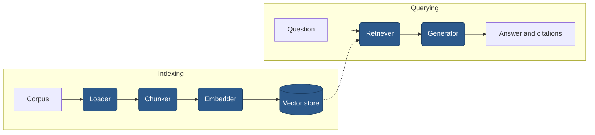

# rag-benchmark-kit

[](https://github.com/heyitspratik/rag-benchmark-kit/actions/workflows/ci.yml)
[](https://codecov.io/gh/heyitspratik/rag-benchmark-kit)
[](https://www.python.org/downloads/)
[](LICENSE)

**Every stage of a RAG pipeline, swappable from one YAML file, with a benchmark harness
that measures which combination actually answers best.**

Not a chat-with-your-PDF demo. The point is evidence: change `chunker.name` from `fixed`
to `structural`, rerun, and see what it did to hit rate, latency and cost across 116
questions over the GDPR and the EU AI Act.

## Results

> **No benchmark run has been published yet.** The harness works end to end and the
> evaluation set is committed and verified, but this table is not filled in, because
> publishing invented figures would defeat the entire purpose of the repository.
>
> Reproduce it yourself:
>
> ```bash
> make up                                        # the whole stack, one command
> make bench                                     # the 24-configuration grid
> rag-bench benchmark report <run_id> --write    # writes results/<name>/
> ```
>
> [`.github/workflows/benchmark.yml`](.github/workflows/benchmark.yml) runs a reduced grid
> on a clean machine, so the result is reproducible rather than merely claimed.

The table it produces is sorted by faithfulness, with the winning row emphasised:

| Chunker | Embedder | Retriever | Faith. | Hit@k | MRR | Abstain | p50 Ret. | Cost $ |
|---|---|---|---|---|---|---|---|---|
| **structural** | **bge_small** | **hybrid_rerank** | | | | | | |
| structural | bge_small | dense | | | | | | |
| _22 further rows_ | | | | | | | | |

**What to look for.** The interesting finding is rarely the top row. It is whether the
expensive configuration earns its cost, since a cross-encoder rerank can add seconds per
query for retrieval quality a plain dense search already matched. Read the per-difficulty
breakdown too: a configuration that wins overall and collapses on multi-hop questions is
telling you something the aggregate hides.

## Architecture



Every shaded stage is chosen by name from a registry. Detail in
[docs/architecture.md](docs/architecture.md).

## Quickstart

Three commands. No API key, no signup, no cost.

```bash
git clone https://github.com/heyitspratik/rag-benchmark-kit && cd rag-benchmark-kit
make up
curl -s localhost:8000/api/v1/queries -H 'Content-Type: application/json' \
  -d '{"question": "Can a controller charge a fee for a subject access request?"}'
```

`make up` starts Postgres, Qdrant and Ollama, applies the migrations, pulls the model,
downloads both regulations and builds the index, then starts the API. Nothing else is
needed before that curl returns a real answer.

> **The first run downloads several gigabytes** of model weights and takes a while. They
> land in a named volume, so later runs start quickly.

Without Docker:

```bash
make dev && make download-corpus && make index
make query Q="Can a controller charge a fee for a subject access request?"
```

The default pipeline runs entirely on your machine: local embeddings on CPU, Ollama for
generation.

## HTTP API

```bash
make serve      # or: uvicorn rag_bench.api.main:app --port 8000
```

| Method | Path | Purpose |
|---|---|---|
| `POST` | `/api/v1/queries` | Ask a question, get an answer with citations |
| `GET` | `/api/v1/configurations` | List every registered component, by stage |
| `POST` | `/api/v1/indexes` | Start an index build (202 with a `Location` header) |
| `GET` | `/api/v1/indexes/{id}` | Poll a build's progress |
| `GET` | `/api/v1/benchmark-runs` | List runs, cursor-paginated |
| `GET` | `/api/v1/benchmark-runs/{id}` | One run with its configurations and metrics |
| `GET` | `/health/live`, `/health/ready` | Liveness and readiness |

Interactive docs at `/docs`, OpenAPI at `/openapi.json`. Every failure shares one
envelope, so a client writes the handling once:

```json
{"error": {"code": "INDEX_NOT_READY", "message": "...", "details": {}, "request_id": "..."}}
```

The `request_id` is echoed in `X-Request-ID`, propagated from the caller when supplied,
and bound to every log line the request produces. Set `API_KEY` to require an `X-API-Key`
header on the write endpoints; leave it unset and the quickstart keeps working.

## Configuration

Everything is chosen by name in [`configs/default.yaml`](configs/default.yaml). Changing a
strategy is a one-word edit with no code change:

```yaml
chunker:
  name: structural          # fixed | recursive | semantic | structural
  params:
    max_chars: 1200
    overlap: 150

embedder:
  name: bge_small           # bge_small | bge_large | e5_base | openai
  params:
    batch_size: 32
    normalize: true

retriever:
  name: hybrid_rerank       # dense | hybrid | hybrid_rerank
  params:
    top_k: 5
    overfetch_multiplier: 4
    bm25_weight: 0.4
    dense_weight: 0.6
```

| Stage | Available | Notes |
|---|---|---|
| corpus | `eu_regulations`, `markdown_docs` | The second proves the pipeline is corpus-agnostic |
| chunker | `fixed`, `recursive`, `semantic`, `structural` | `fixed` is the naive baseline |
| embedder | `bge_small`, `bge_large`, `e5_base`, `openai` | The first three run locally on CPU |
| store | `qdrant`, `pgvector` | Two genuinely different backends behind one interface |
| retriever | `dense`, `hybrid`, `hybrid_rerank` | Hybrid fuses BM25 and vectors by rank |
| generator | `cited` | Validates its own citations and raises on a bad one |

Secrets and machine-specific values live in the environment, never in YAML. Copy
[`.env.example`](.env.example) to `.env`.

## Extending

Adding a chunking strategy is a class and a decorator. Nothing else changes: not the
pipeline, not the config schema, not the benchmark runner, not the API.

```python
# src/rag_bench/components/chunkers/sentence.py
from rag_bench.core.interfaces import BaseChunker
from rag_bench.core.models import Chunk, Document
from rag_bench.core.registry import register_chunker


@register_chunker("sentence")
class SentenceChunker(BaseChunker):
    """One chunk per sentence, skipping fragments."""

    def __init__(self, min_chars: int = 40) -> None:
        self._min_chars = min_chars

    def chunk(self, document: Document) -> list[Chunk]:
        chunks: list[Chunk] = []
        start = 0
        for piece in document.text.split(". "):
            end = start + len(piece)
            if len(piece.strip()) >= self._min_chars:
                chunks.append(
                    Chunk.create(
                        doc_id=document.id,
                        ordinal=len(chunks),
                        text=piece,
                        char_start=start,
                        char_end=end,
                    )
                )
            start = end + 2
        return chunks
```

Import it in `components/chunkers/__init__.py`, then use it:

```yaml
chunker:
  name: sentence
  params:
    min_chars: 40
```

It now appears in `GET /api/v1/configurations` and can be swept by the benchmark, because
both read the registry rather than a fixed list.

**The one rule.** Set truthful `char_start` and `char_end`. Those offsets are how a chunk
is mapped back to the document sections that ground truth cites, and they are what make
your strategy comparable to every other one.

## Benchmark methodology

Full detail in [docs/benchmark-methodology.md](docs/benchmark-methodology.md). In short:

- **Corpus.** GDPR and EU AI Act from the EU Publications Office. 99 and 113 articles, 872
  numbered paragraphs, parsed with character offsets.
- **Evaluation set.** 116 pairs: 46 single-hop, 49 multi-hop, 11 definitional, 10
  negative. LLM-drafted from the extracted article text, then checked by
  `rag-bench eval verify`, which found 0 citation errors and 94.8% mean answer support on
  2026-08-27. **No human has read them yet.**
- **Metrics.** `hit_rate`, `mrr`, `abstention_accuracy`, latency percentiles and cost are
  computed directly and rerun identically. The four RAGAS metrics are LLM-judged and
  optional.
- **Index reuse.** 24 configurations share 8 indexes, so the corpus is ingested 8 times
  rather than 24.
- **Reproducibility.** Every run records the commit, whether the tree was dirty, and the
  provider and model that generated the answers.

## Limitations

An honest list. The numbers are worth less without it.

- **The evaluation set has not been human-verified.** The automated check proves an
  answer's wording comes from the article it cites, not that it is a fair reading of the
  law. This is the largest caveat here.
- **RAGAS metrics are LLM-judged** and carry the judge's own variance. Two runs of one
  configuration will not produce identical faithfulness scores.
- **116 questions is a small sample.** Differences of a few points sit inside the noise.
  On the 10-question smoke set several configurations tie outright.
- **Definitional questions are scored loosely.** GDPR Article 4 and AI Act Article 3 hold
  every definition in a single article, 8,700 and 17,300 characters, so any overlapping
  chunk counts as a hit. The other 121 citations are paragraph-level, median span 473
  characters.
- **Results are corpus-specific.** Two English EU regulations. Nothing here says the same
  chunker wins on medical notes, source code or support tickets.
- **English only**, corpus and embedding models alike.
- **The image is about 1.3 GB**, most of it CPU PyTorch. Dropping local embeddings would
  fit it under 500 MB and make the free quickstart impossible. A trade, not an oversight.
- **Latency is machine-specific.** Compare configurations within a run, not across
  machines.
- **No Kubernetes manifests.** This is a tool that is run, not a service that is operated.

## Project structure

```
src/rag_bench/
├── core/
│   ├── interfaces/       # One abstract base class per swappable stage
│   ├── registry.py       # Name to implementation, the extension point
│   ├── models.py         # Document, Chunk, ScoredChunk, Answer
│   ├── config.py         # Validated experiment YAML, config fingerprints
│   ├── settings.py       # Environment layer, per-provider credential rules
│   └── llm.py            # One chat-model factory, Ollama health probe
├── components/           # Every implementation, registered on import
│   ├── loaders/          # Corpus download and per-format parsing
│   ├── chunkers/         # fixed, recursive, semantic, structural
│   ├── embedders/        # Local sentence-transformers models, OpenAI
│   ├── stores/           # Qdrant, pgvector
│   ├── retrievers/       # dense, hybrid, hybrid_rerank, RRF fusion
│   └── generators/       # Cited generation and citation validation
├── pipeline/             # Indexer and querier, assembled from config alone
├── benchmark/            # Grid, runner, metrics, RAGAS, reporter, eval verification
├── db/                   # SQLAlchemy models, schema owned by Alembic
├── api/                  # FastAPI app, one error envelope, health checks
└── cli/                  # Typer commands

configs/                  # Committed experiment descriptions
data/eval/                # The evaluation set, committed
alembic/versions/         # Migrations, from the first commit
docker/                   # Multi-stage Dockerfile and the compose stack
docs/                     # Architecture and benchmark methodology
results/                  # Published numbers
```

## Development

```bash
make check              # ruff, mypy --strict, pytest with a coverage floor
make test-integration   # needs Docker for Postgres and Qdrant
make verify-eval        # re-check every evaluation pair against the corpus
```

511 tests, 94% coverage, `mypy --strict` clean. No test requires an API key, a network,
or a running Ollama.

## Contributing

Issues and pull requests are welcome. `make check` must pass, PR titles follow
[conventional commits](https://www.conventionalcommits.org/), and a new component belongs
behind its interface rather than special-cased around it.

## Acknowledgements

- The EU Publications Office, for making both regulations freely available.
- [BAAI](https://huggingface.co/BAAI) for the BGE embedding and reranking models.
- [Qdrant](https://qdrant.tech/), [pgvector](https://github.com/pgvector/pgvector),
  [Ollama](https://ollama.com/), [RAGAS](https://docs.ragas.io/) and
  [uv](https://docs.astral.sh/uv/).

## Licence

MIT. See [LICENSE](LICENSE).
