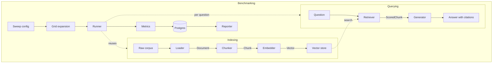
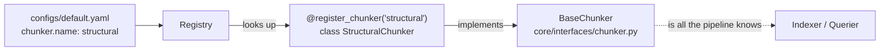

# Architecture

## The pipeline

Six stages. Each one is an abstract base class in `core/interfaces/`, one or more
implementations in `components/`, and a registry entry mapping a config-facing name to a
class. Nothing in the pipeline mentions a concrete implementation.

## The extension point

This is the single most important structural decision in the repository. Every swappable
stage follows the same three parts:

Adding a strategy means writing a class and decorating it. No edit to the pipeline, the
config schema, the benchmark runner, or the API. `GET /api/v1/configurations` reports it
immediately, because that route reads the registries rather than a hardcoded list.

## Decisions worth knowing

### Structure lives in the loader, not the chunker

The loader marks up document sections, such as `GDPR Art. 15(4)`, with character offsets.
The structural chunker consumes those sections rather than re-deriving them, so it works
unchanged on Markdown, and the article-parsing regex exists in exactly one place.

### Chunks carry character offsets, and the indexer annotates them

Ground truth is expressed as section references. A `fixed` chunker knows nothing about
articles, so without offsets its output could never be scored against that ground truth,
and `hit_rate` would only be computable for one strategy. The indexer maps each chunk's
offsets back to the sections it overlaps, which is what makes the central comparison of
the benchmark valid at all.

### Retrieval determines the index; the retriever does not

Chunker and embedder decide what is stored. The retriever reads what is already there.
The benchmark groups configurations on that fact, so the default 24-configuration grid
performs 8 ingestions rather than 24.

### Results are written as they are produced

A grid takes hours. Writing at the end would mean a crash at configuration 19 discards
the first 18. Everything lands as each question is answered, which is also exactly what
makes `benchmark resume` possible.

### Two configuration layers, kept apart

Secrets and machine-specific values are environment variables read through
pydantic-settings. Experiment descriptions are committed YAML. The second is the
reproducible record of a run; the first must never be.

## Module map

| Path | Responsibility |
|---|---|
| `core/interfaces/` | The contract for each stage. No implementation detail. |
| `core/registry.py` | Name to implementation, one registry per stage |
| `core/models.py` | `Document`, `Chunk`, `ScoredChunk`, `Answer` |
| `core/config.py` | Validated experiment YAML, config fingerprints |
| `core/settings.py` | Environment layer, per-provider credential rules |
| `core/llm.py` | One chat-model factory, Ollama health probe |
| `components/loaders/` | Corpus download and per-format parsing |
| `components/chunkers/` | `fixed`, `recursive`, `semantic`, `structural` |
| `components/embedders/` | Local sentence-transformers models, OpenAI |
| `components/stores/` | Qdrant, pgvector |
| `components/retrievers/` | `dense`, `hybrid`, `hybrid_rerank`, RRF fusion |
| `components/generators/` | The cited generator and citation validation |
| `pipeline/` | `indexer` and `querier`, assembled from config alone |
| `benchmark/` | Grid, runner, metrics, RAGAS, reporter, eval-set verification |
| `db/` | SQLAlchemy models and session handling |
| `api/` | FastAPI app, routes, error envelope, middleware |
| `cli/` | Typer commands |

## Why there is no Kubernetes here

This is a benchmark tool that is run, not a service that is operated. A Helm chart done
well once, in the repository that actually needs it, is worth more than one done twice
adequately. The compose stack covers everything this project needs.
